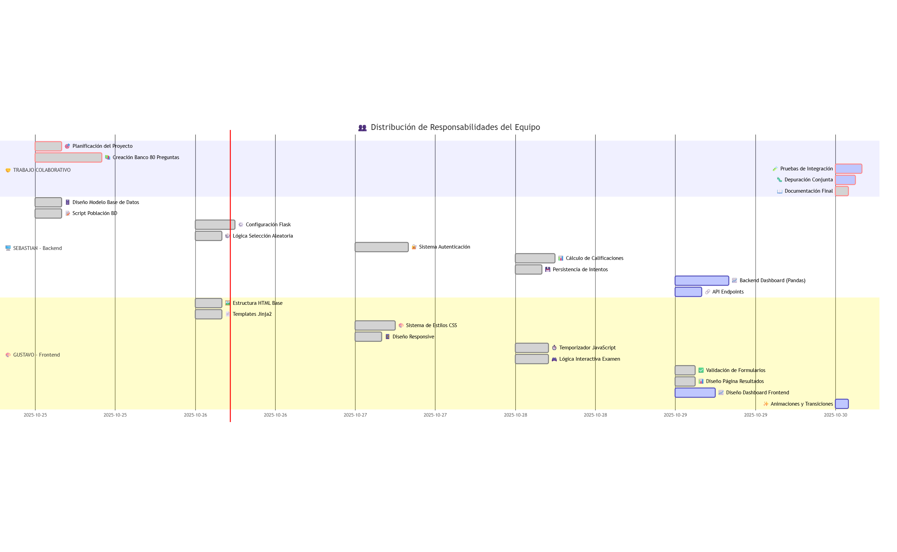

```
 gantt
    dateFormat  YYYY-MM-DD
    title       👥 Distribución de Responsabilidades del Equipo
    
    section 🤝 TRABAJO COLABORATIVO
    🎯 Planificación del Proyecto          :crit, done, collab1, 2025-10-25, 4h
    📚 Creación Banco 80 Preguntas         :crit, done, collab2, 2025-10-25, 10h
    🧪 Pruebas de Integración              :crit, active, collab3, 2025-10-30, 4h
    🐛 Depuración Conjunta                 :crit, active, collab4, 2025-10-30, 3h
    📖 Documentación Final                 :crit, done, collab5, 2025-10-30, 2h
    
    section 🖥️ SEBASTIAN - Backend
    🗄️ Diseño Modelo Base de Datos        :done, seb1, 2025-10-25, 4h
    📝 Script Población BD                 :done, seb2, 2025-10-25, 4h
    ⚙️ Configuración Flask                 :done, seb3, 2025-10-26, 6h
    🎲 Lógica Selección Aleatoria          :done, seb4, 2025-10-26, 4h
    🔐 Sistema Autenticación               :done, seb5, 2025-10-27, 8h
    📊 Cálculo de Calificaciones           :done, seb6, 2025-10-28, 6h
    💾 Persistencia de Intentos            :done, seb7, 2025-10-28, 4h
    📈 Backend Dashboard (Pandas)          :active, seb8, 2025-10-29, 8h
    🔗 API Endpoints                       :active, seb9, 2025-10-29, 4h
    
    section 🎨 GUSTAVO - Frontend
    🖼️ Estructura HTML Base                :done, gus1, 2025-10-26, 4h
    📄 Templates Jinja2                    :done, gus2, 2025-10-26, 4h
    🎨 Sistema de Estilos CSS              :done, gus3, 2025-10-27, 6h
    📱 Diseño Responsive                   :done, gus4, 2025-10-27, 4h
    ⏱️ Temporizador JavaScript             :done, gus5, 2025-10-28, 5h
    🎮 Lógica Interactiva Examen           :done, gus6, 2025-10-28, 5h
    ✅ Validación de Formularios           :done, gus7, 2025-10-29, 3h
    📊 Diseño Página Resultados            :done, gus8, 2025-10-29, 3h
    📈 Diseño Dashboard Frontend           :active, gus9, 2025-10-29, 6h
    ✨ Animaciones y Transiciones          :active, gus10, 2025-10-30, 2h

```
