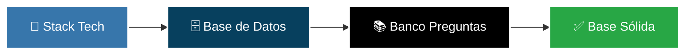

<div align="center">

# 📋 Estrategia, Planificación y Metodología

### *Del concepto a la implementación: Nuestro proceso de desarrollo*


</div>

---

## 📚 Tabla de Contenidos

- [🎯 Visión General](#-visión-general)
- [🏗️ Estrategia de Desarrollo](#️-estrategia-de-desarrollo)
- [🔄 Ciclo de Desarrollo Iterativo](#-ciclo-de-desarrollo-iterativo)
- [👥 Organización del Equipo](#-organización-del-equipo)
- [🛠️ Herramientas y Prácticas](#️-herramientas-y-prácticas)

---

## 🎯 Visión General

<div align="center">

```
📐 Metodología Ágil + 🔄 Prototipado Iterativo = 🚀 Entrega de Valor Incremental
```

</div>

Para abordar este proyecto, adoptamos una **metodología de desarrollo Ágil** combinada con elementos de **prototipado iterativo**. Esta estrategia nos permite:

<table>
<tr>
<td width="33%" align="center">

### 🧩 Dividir
Separar el proyecto en<br/>fases manejables

</td>
<td width="33%" align="center">

### 📦 Entregar
Valor de manera<br/>incremental

</td>
<td width="33%" align="center">

### 🔧 Adaptar
El desarrollo según<br/>nuevos desafíos

</td>
</tr>
</table>

---

## 🏗️ Estrategia de Desarrollo

### 1️⃣ **Fundamentos Primero** (Core First Approach)

> *"Una base sólida es la clave del éxito"*

El desarrollo comenzó estableciendo los **cimientos tecnológicos** del proyecto:



<table>
<tr>
<td width="33%">

#### 🔧 Stack Tecnológico
- Python 3.10+
- Framework Flask
- ORM SQLAlchemy
- SQLite Database

</td>
<td width="33%">

#### 📐 Diseño de BD
- Modelo relacional normalizado
- 4 tablas principales
- Relaciones definidas
- Integridad referencial

</td>
<td width="33%">

#### 📝 Contenido
- 80 preguntas oficiales
- Imágenes de señales
- Respuestas validadas
- Explicaciones detalladas

</td>
</tr>
</table>

---

## 🔄 Ciclo de Desarrollo Iterativo

### 📊 Roadmap de Desarrollo

Cada funcionalidad se desarrolló como un **incremento funcional** independiente:

```
┌─────────────────────────────────────────────────────────────────┐
│                     🚀 LÍNEA DE TIEMPO                          │
└─────────────────────────────────────────────────────────────────┘

Sprint 1        Sprint 2        Sprint 3        Sprint 4
   │               │               │               │
   ▼               ▼               ▼               ▼
┌──────┐      ┌──────┐      ┌──────┐      ┌──────┐
│ 📝   │      │ 👤   │      │ ⚡   │      │ 📊   │
│ Base │  ➜   │ Users│  ➜   │Avanz.│  ➜   │Analy.│
└──────┘      └──────┘      └──────┘      └──────┘
```

---

### 🎯 Iteración 1: Flujo de Examen Básico

<div align="center">

**🎯 Objetivo:** Implementar el MVP del simulador

</div>

| Componente | Descripción | Estado |
|:-----------|:------------|:------:|
| 📝 **Interfaz de Examen** | Mostrar preguntas y capturar respuestas | ✅ |
| 🎲 **Selección Aleatoria** | Escoger 20 preguntas sin repetir | ✅ |
| 📊 **Cálculo de Puntaje** | Sistema de calificación básico | ✅ |
| 📄 **Página de Resultados** | Mostrar calificación final | ✅ |

```python
# Enfoque inicial con datos temporales
def tomar_examen():
    preguntas = seleccionar_preguntas_aleatorias(20)
    return render_template('test.html', preguntas=preguntas)
```

**🎁 Entregable:** Prototipo funcional del simulador sin persistencia

---

### 👤 Iteración 2: Sistema de Usuarios y Persistencia

<div align="center">

**🎯 Objetivo:** Transformar datos temporales en permanentes

</div>

| Componente | Descripción | Estado |
|:-----------|:------------|:------:|
| 🔐 **Registro de Usuarios** | Sistema de creación de cuentas | ✅ |
| 🔑 **Login Seguro** | Autenticación con encriptación | ✅ |
| 🗄️ **Base de Datos SQLite** | Persistencia de usuarios e intentos | ✅ |
| 📈 **Historial Personal** | Tracking de intentos por usuario | ✅ |

```python
# Migración a persistencia real
class Usuario(db.Model):
    id = db.Column(db.Integer, primary_key=True)
    intentos = db.relationship('Intento', backref='usuario')
```

**🎁 Entregable:** Sistema completo de gestión de usuarios

---

### ⚡ Iteración 3: Funcionalidades Avanzadas

<div align="center">

**🎯 Objetivo:** Implementar requisitos específicos del proyecto

</div>

<table>
<tr>
<td width="50%">

#### 🎮 Modo Práctica
- ⏱️ Temporizador de 60s por pregunta
- 🔄 Límite de 6 intentos
- 📝 20 preguntas (5 pts c/u)
- ✅ Retroalimentación inmediata

</td>
<td width="50%">

#### 🏁 Modo Examen Final
- ⏰ Temporizador global
- 🎫 Límite de 3 intentos
- 📋 40 preguntas (2.5 pts c/u)
- 📊 Resultados detallados

</td>
</tr>
</table>

```javascript
// Implementación del temporizador
let tiempoRestante = 60;
const intervalo = setInterval(() => {
    tiempoRestante--;
    if (tiempoRestante === 0) {
        marcarComoIncorrecta();
        siguientePregunta();
    }
}, 1000);
```

**🎁 Entregable:** Simulador completo con todas las funcionalidades

---

### 📊 Iteración 4: Análisis y Visualización

<div align="center">

**🎯 Objetivo:** Dashboard de análisis de datos

</div>

| Métrica | Visualización | Insight |
|:--------|:--------------|:--------|
| 📈 **Progreso de Aprendizaje** | Gráfico de línea | Mejora del puntaje por intento |
| 🎯 **Efectividad de Práctica** | Gráfico de barras | Correlación práctica vs. aprobación |
| 🏆 **Tasa de Éxito** | Indicador porcentual | % de aprobación en examen final |

```python
# Análisis con Pandas y Matplotlib
import pandas as pd
import matplotlib.pyplot as plt

def generar_graficos():
    df = pd.DataFrame(intentos_db)
    df.groupby('numero_intento')['puntaje'].mean().plot()
```

**🎁 Entregable:** Sistema de métricas y análisis visual

---

## 👥 Organización del Equipo

### 🎭 División de Responsabilidades

<div align="center">

```
                    🏗️ ARQUITECTURA DEL PROYECTO
                              
         ┌─────────────────────────────────────────┐
         │         PROYECTO COMPLETO               │
         └───────────────┬─────────────────────────┘
                         │
            ┌────────────┴────────────┐
            │                         │
            ▼                         ▼
    ┌───────────────┐         ┌───────────────┐
    │   BACKEND     │         │   FRONTEND    │
    │   🖥️ Server   │  ◄────► │   🎨 Client   │
    │               │         │               │
    │  Sebastian    │         │   Gustavo     │
    │    Chapa      │         │   Cortés      │
    └───────────────┘         └───────────────┘
```

</div>

---

### 🖥️ Backend - Sebastian Chapa

<table>
<tr>
<td width="50%">

#### 🎯 Responsabilidades Core

- 🗄️ Diseño del modelo de datos
- 🔧 Lógica de negocio
- 🔐 Sistema de autenticación
- 📊 Procesamiento de datos
- 🔄 APIs y endpoints

</td>
<td width="50%">

#### 📦 Tecnologías

```python
# Stack Backend
- Python 3.10+
- Flask Framework
- SQLAlchemy ORM
- Werkzeug Security
- Pandas & Matplotlib
```

</td>
</tr>
</table>

#### 💡 Contribuciones Destacadas

```python
✅ Arquitectura de la base de datos relacional
✅ Sistema de selección aleatoria de preguntas
✅ Implementación de límites de intentos
✅ Cálculo automático de puntajes
✅ Generación de gráficos de análisis
```

---

### 🎨 Frontend - Gustavo Cortés

<table>
<tr>
<td width="50%">

#### 🎯 Responsabilidades Core

- 🖼️ Diseño de interfaces
- 🎨 Estilos y maquetación CSS
- ⚡ Interactividad JavaScript
- ⏱️ Implementación de temporizadores
- 📱 Responsive design

</td>
<td width="50%">

#### 📦 Tecnologías

```html
<!-- Stack Frontend -->
- HTML5 semántico
- CSS3 (Flexbox/Grid)
- JavaScript ES6+
- Jinja2 Templates
- Fetch API
```

</td>
</tr>
</table>

#### 💡 Contribuciones Destacadas

```javascript
✅ Interfaces intuitivas y amigables
✅ Temporizadores visuales interactivos
✅ Validación de formularios en tiempo real
✅ Animaciones y transiciones fluidas
✅ Sistema de navegación responsivo
```

---

### 🤝 Puntos de Colaboración

<div align="center">

| Área | Backend 🖥️ | Frontend 🎨 | Resultado 🎯 |
|:-----|:----------|:-----------|:-----------|
| **Examen** | Provee preguntas JSON | Renderiza interfaz dinámica | Sistema funcional |
| **Resultados** | Calcula puntajes | Muestra visualización | Feedback completo |
| **Usuarios** | Gestiona autenticación | Valida formularios | Experiencia segura |
| **Dashboard** | Genera datos de gráficos | Integra Matplotlib | Análisis visual |

</div>

---

## 🛠️ Herramientas y Prácticas

### 🔧 Control de Versiones

<div align="center">


</div>

```bash
# Flujo de trabajo Git
git checkout -b feature/nueva-funcionalidad
git add .
git commit -m "feat: implementación de temporizador"
git push origin feature/nueva-funcionalidad
# Pull Request → Code Review → Merge
```

#### 📋 Convenciones de Commits

| Prefijo | Uso | Ejemplo |
|:--------|:----|:--------|
| `feat:` | Nueva funcionalidad | `feat: sistema de login` |
| `fix:` | Corrección de bugs | `fix: error en temporizador` |
| `docs:` | Documentación | `docs: actualizar README` |
| `style:` | Cambios visuales | `style: mejorar CSS del login` |
| `refactor:` | Refactorización | `refactor: optimizar queries` |

---

### 💬 Metodología de Comunicación

<table>
<tr>
<td width="50%">

#### 📅 Reuniones Periódicas

- **Daily Standup** (15 min)
  - ✅ ¿Qué hice ayer?
  - 🎯 ¿Qué haré hoy?
  - 🚧 ¿Tengo bloqueos?

- **Sprint Review** (semanal)
  - 📦 Demo de funcionalidades
  - 📊 Revisión de progreso
  - 🎯 Planificación siguiente sprint

</td>
<td width="50%">

#### 🎯 Objetivos de Comunicación

- ✅ Sincronizar avances
- 🚧 Resolver bloqueos rápidamente
- 📋 Planificar próximos pasos
- 🔄 Compartir aprendizajes
- 💡 Brainstorming de soluciones

</td>
</tr>
</table>

---

### 📊 Seguimiento de Progreso

#### 🎯 Métricas de Desarrollo

```
Sprint 1: ████████░░  80% - Base funcional completada
Sprint 2: ██████████ 100% - Sistema de usuarios operativo
Sprint 3: ██████████ 100% - Funcionalidades avanzadas listas
Sprint 4: ████████░░  85% - Dashboard y análisis funcionando
```

#### ✅ Definición de "Hecho"

Una funcionalidad se considera **completa** cuando:

- ✅ El código está implementado y testeado
- ✅ La documentación está actualizada
- ✅ Los cambios están integrados en la rama principal
- ✅ El equipo completo ha revisado el código
- ✅ Las pruebas manuales son exitosas

---

## 🎓 Lecciones Aprendidas

<table>
<tr>
<td width="50%">

### ✅ **Lo que Funcionó**

- 🎯 División clara de responsabilidades
- 🔄 Desarrollo iterativo e incremental
- 💬 Comunicación frecuente
- 🧩 Arquitectura modular
- 📚 Documentación continua

</td>
<td width="50%">

### 🔄 **Áreas de Mejora**

- ⏱️ Estimación de tiempos
- 🧪 Implementar testing automatizado
- 📱 Optimización móvil temprana
- 🔐 Revisión de seguridad continua
- 📊 Monitoreo de performance

</td>
</tr>
</table>

---

<div align="center">

## 🎯 Resultado Final

> *"Un proyecto exitoso no es solo código que funciona,<br/>es un equipo que colabora efectivamente"*

### Stack Final


---

**📅 Duración Total:** 4 Sprints | **👥 Equipo:** 2 Desarrolladores | **📊 Resultado:** 100% Funcional

---

### 💪 Equipo de Desarrollo

**Sebastian Chapa** • Backend Developer<br/>
**Gustavo Cortés** • Frontend Developer

---

*Desarrollado con metodología Ágil y mucho ☕*

</div>