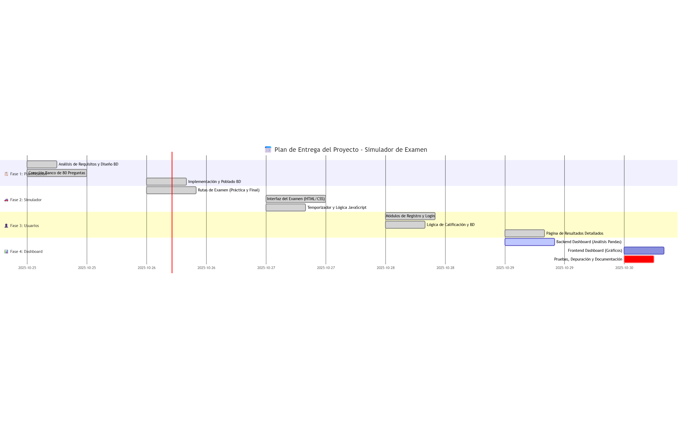

''' 
gantt
    title 📅 Plan de Entrega del Proyecto - Simulador de Examen
    dateFormat YYYY-MM-DD
    
    section 📋 Fase 1: Planificación
    Análisis de Requisitos y Diseño BD           :done,    req1, 2025-10-25, 6h
    Creación Banco de 80 Preguntas               :done,    cont1, 2025-10-25, 12h
    Implementación y Poblado BD                  :done,    db1, 2025-10-26, 8h

    section 🚗 Fase 2: Simulador
    Rutas de Examen (Práctica y Final)           :done,    dev1, 2025-10-26, 10h
    Interfaz del Examen (HTML/CSS)               :done,    ui1, 2025-10-27, 12h
    Temporizador y Lógica JavaScript             :done,    js1, 2025-10-27, 8h

    section 👤 Fase 3: Usuarios
    Módulos de Registro y Login                  :done,    auth1, 2025-10-28, 10h
    Lógica de Calificación y BD                  :done,    calc1, 2025-10-28, 8h
    Página de Resultados Detallados              :done,    res1, 2025-10-29, 8h

    section 📊 Fase 4: Dashboard
    Backend Dashboard (Análisis Pandas)          :active,  dash1, 2025-10-29, 10h
    Frontend Dashboard (Gráficos)                :         graph1, 2025-10-30, 8h
    Pruebas, Depuración y Documentación          :crit,    final1, 2025-10-30, 6h

'''
