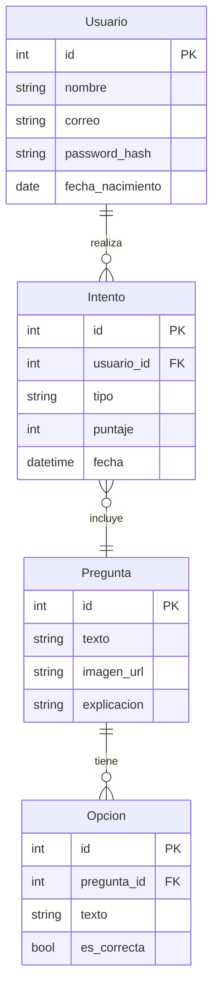

<div align="center">

# 🚘 Simulador de Examen Teórico de Manejo

### *Tu herramienta completa para aprobar el examen de conducir*


[📚 Documentación](#-guía-de-instalación) · [🎯 Características](#-características-principales) · [👥 Equipo](#-equipo-de-desarrollo)

</div>

---

## 📋 Tabla de Contenidos

- [🎯 Visión General](#-visión-general)
- [✨ Características Principales](#-características-principales)
- [🛠️ Stack Tecnológico](#️-stack-tecnológico)
- [🗄️ Arquitectura de la Base de Datos](#️-arquitectura-de-la-base-de-datos)
- [📁 Estructura del Proyecto](#-estructura-del-proyecto)
- [🚀 Guía de Instalación](#-guía-de-instalación)
- [📊 Modos de Evaluación](#-modos-de-evaluación)
- [👥 Equipo de Desarrollo](#-equipo-de-desarrollo)
- [📄 Licencia](#-licencia)

---

## 🎯 Visión General

> **Una plataforma web interactiva diseñada para maximizar tus probabilidades de éxito en el examen teórico de manejo**

Este simulador es mucho más que un simple cuestionario. Es un **sistema completo de aprendizaje y evaluación** que te permite:

- ✅ Practicar con un banco de **80 preguntas oficiales** del Manual del Conductor de California
- 📈 Rastrear tu progreso con análisis detallados
- 🎓 Prepararte en condiciones reales con temporizadores y límites de intentos
- 🖼️ Aprender con contenido visual rico en imágenes de señales de tráfico

<div align="center">

### 🎮 **¿Listo para aprobar?**

**6 prácticas** + **3 exámenes finales** = *Tu licencia de conducir*

</div>

---

## ✨ Características Principales

<table>
<tr>
<td width="50%">

### 👤 **Sistema de Usuarios Completo**

- 🔐 Registro seguro con validación de edad
- 🔑 Autenticación con encriptación de contraseñas
- 📊 Panel personalizado de seguimiento
- 🎫 Sistema de folio de pago (`001`)
- 📉 Historial completo de intentos

</td>
<td width="50%">

### 📊 **Dashboard Analítico**

- 📈 Gráficos de progreso en tiempo real
- 🎯 Indicadores de aprendizaje
- 💡 Análisis de efectividad de práctica
- 🏆 Correlación práctica vs. éxito
- 📉 Visualización con Matplotlib

</td>
</tr>
</table>

---

## 📊 Modos de Evaluación

<div align="center">

| 🎮 Característica | 🚗 Modo Práctica | 🏁 Examen Final |
|:-----------------:|:----------------:|:---------------:|
| **Preguntas** | 20 aleatorias | 40 aleatorias |
| **Puntos/Pregunta** | 5 puntos | 2.5 puntos |
| **Temporizador** | 60s por pregunta | Total del examen |
| **Intentos Permitidos** | 6 intentos | 3 intentos |
| **Calificación Mínima** | 75% (15/20) | 75% (30/40) |
| **Retroalimentación** | ✅ Inmediata | ✅ Al finalizar |

</div>

### 🎯 Modo Práctica

```
🎲 20 preguntas aleatorias del banco de 80
⏱️ 60 segundos por pregunta
📝 5 puntos por respuesta correcta
🔄 Hasta 6 intentos disponibles
✅ Retroalimentación detallada con explicaciones
```

### 🏆 Modo Examen Final

```
📋 40 preguntas (simulación oficial)
⏰ Temporizador global (40 minutos)
🎯 2.5 puntos por respuesta correcta
🎫 Máximo 3 intentos
📊 Resultados detallados con revisión completa
```

---

## 🛠️ Stack Tecnológico

<div align="center">

### Backend


### Frontend


### Base de Datos & Análisis


</div>

---

## 🗄️ Arquitectura de la Base de Datos



### 📦 Tablas Principales

| Tabla | Descripción | Campos Clave |
|-------|-------------|--------------|
| **Usuario** | Información de usuarios registrados | `id`, `nombre`, `correo`, `password_hash` |
| **Pregunta** | Banco de 80 reactivos | `id`, `texto`, `imagen_url`, `explicacion` |
| **Opcion** | Respuestas para cada pregunta | `id`, `pregunta_id`, `texto`, `es_correcta` |
| **Intento** | Registro de exámenes realizados | `id`, `usuario_id`, `tipo`, `puntaje`, `fecha` |

---

## 📁 Estructura del Proyecto

```
📦 simulador_examen/
┣ 📜 app.py                    # 🧠 Lógica principal de Flask
┣ 📜 poblar_db.py              # 🌱 Script de inicialización de BD
┣ 📜 preguntas.json            # 📚 Banco de preguntas
┣ 📜 simulador.db              # 🗄️ Base de datos SQLite
┣ 📜 README.md                 # 📖 Este archivo
┃
┣ 📂 venv/                     # 🐍 Entorno virtual Python
┃
┣ 📂 static/
┃  ┗ 📂 images/
┃     ┣ 🖼️ no_u_turn.png
┃     ┣ 🖼️ stop_sign.png
┃     ┗ 🖼️ ... (más señales)
┃
┗ 📂 templates/
   ┣ 📄 index.html             # 🏠 Página de inicio
   ┣ 📄 login.html             # 🔐 Inicio de sesión
   ┣ 📄 signup.html            # ✍️ Registro de usuario
   ┣ 📄 test.html              # 📝 Interfaz de examen
   ┣ 📄 resultado.html         # 📊 Resultados detallados
   ┗ 📄 dashboard.html         # 📈 Panel de análisis
```

---

## 🚀 Guía de Instalación

### 📋 Prerrequisitos

- Python 3.10 o superior
- pip (gestor de paquetes de Python)
- Git

### 🔧 Instalación Paso a Paso

#### 1️⃣ Clonar el repositorio

```bash
git clone [URL_DEL_REPOSITORIO]
cd simulador_examen
```

#### 2️⃣ Crear entorno virtual

```bash
# Windows
python -m venv venv
venv\Scripts\activate

# macOS/Linux
python3 -m venv venv
source venv/bin/activate
```

#### 3️⃣ Instalar dependencias

```bash
pip install Flask Flask-SQLAlchemy Werkzeug pandas matplotlib
```

#### 4️⃣ Inicializar la base de datos

```bash
python poblar_db.py
```

> ⚠️ **Nota:** Ejecuta este comando solo una vez para crear y poblar la base de datos.

#### 5️⃣ Ejecutar la aplicación

```bash
python app.py
```

#### 6️⃣ Acceder al simulador

Abre tu navegador en: **http://127.0.0.1:5000**

---

## 🎓 Flujo de Usuario

```
┌─────────────────┐
│  1. Registro    │  ➜  Crea tu cuenta con email y contraseña
└────────┬────────┘
         │
┌────────▼────────┐
│  2. Login       │  ➜  Ingresa con folio de pago (001)
└────────┬────────┘
         │
┌────────▼────────┐
│  3. Práctica    │  ➜  Realiza hasta 6 intentos (20 preguntas)
└────────┬────────┘
         │
┌────────▼────────┐
│  4. Examen      │  ➜  Toma el examen final (40 preguntas)
└────────┬────────┘
         │
┌────────▼────────┐
│  5. Dashboard   │  ➜  Analiza tu progreso y mejora
└─────────────────┘
```

---

## 👥 Equipo de Desarrollo

<table align="center">
  <tr>
    <td align="center">
      
      <br />
      <sub><b>Sebastian Chapa</b></sub>
      <br />
      <sub>Full Stack Developer</sub>
    </td>
    <td align="center">
      
      <br />
      <sub><b>Gustavo Cortes</b></sub>
      <br />
      <sub>Full Stack Developer</sub>
    </td>
  </tr>
</table>

---

## 📄 Licencia

Este proyecto fue desarrollado como parte de un proyecto educativo.

---

<div align="center">

### 🌟 ¿Te gustó el proyecto? ¡Dale una estrella! ⭐

**Hecho con ❤️ por Sebastian Chapa y Gustavo Cortes**

</div>